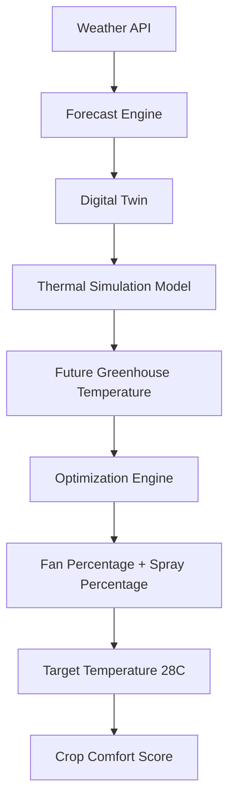

# GreenTwin AI

Real-Time Digital Twin for Greenhouse Climate Optimization Using Weather Forecast Streams and Adaptive Cooling Control

## Overview

GreenTwin AI is a greenhouse monitoring platform that replaces ML temperature forecasting with a live Digital Twin.

The current implementation:
- pulls live or simulated weather from `WeatherAPI.com` or `OpenWeatherMap`
- models greenhouse temperature with heat-transfer and environmental equations
- predicts 10 minute, 30 minute, 1 hour, and 2 hour greenhouse temperatures
- searches for the lowest-cost fan and spray strategy to hold the target near `28C`
- tracks crop comfort, energy use, water use, and historical simulation logs

## Architecture



## Thermal Model

GreenTwin AI uses a medium greenhouse by default:
- `k = 0.3`
- `s = 0.2`
- `w = 0.1`

Supported greenhouse profiles:

| Type | k | s | w |
| --- | --- | --- | --- |
| Small | 0.4 | 0.25 | 0.08 |
| Medium | 0.3 | 0.2 | 0.1 |
| Large | 0.2 | 0.15 | 0.15 |

Simulation step:

```text
FutureTemperature =
CurrentInsideTemperature
+ HeatGain
+ SolarGain
- WindCooling
- FanCooling
- SprayCooling
```

Where:
- `HeatGain = k * (OutsideTemperature - InsideTemperature)`
- `SolarGain = s * SolarRadiationFactor`
- `WindCooling = w * WindSpeed`
- `FanCooling` and `SprayCooling` depend on the selected control percentages

## Stack

- Frontend: React, TypeScript, Tailwind CSS, Recharts
- Backend: FastAPI, SQLAlchemy
- Database: PostgreSQL-ready via `DATABASE_URL`, with SQLite fallback for local development
- Deployment: Vercel for the frontend, Render for the backend

## Project Structure

```text
backend/               FastAPI API, weather clients, simulation engine, optimizer
frontend/              React + TypeScript dashboard
tests/                 Digital twin unit tests
data/                  Local runtime data, including SQLite fallback storage
```

## Local Development

### Backend

```bash
python3 -m venv .venv
source .venv/bin/activate
pip install -r backend/requirements.txt
uvicorn backend.main:app --reload
```

Backend URLs:
- API root: `http://127.0.0.1:8000/`
- Swagger docs: `http://127.0.0.1:8000/docs`
- Health check: `http://127.0.0.1:8000/health`

### Frontend

```bash
cd frontend
cp .env.example .env
npm install
npm run dev
```

Frontend URL:
- `http://127.0.0.1:5173`

### Environment Variables

Copy `.env.example` and set the values you need:

- `WEATHERAPI_KEY`
- `OPENWEATHERMAP_API_KEY`
- `DATABASE_URL`
- `DEFAULT_LOCATION`
- `GREENHOUSE_TYPE`
- `TARGET_TEMPERATURE_C`
- `GREENTWIN_POLL_INTERVAL_SECONDS`
- `VITE_API_BASE_URL`

For local development, `frontend/.env.example` defaults `VITE_API_BASE_URL` to `/api/v1`, and Vite proxies that to the FastAPI backend on `http://127.0.0.1:8000`.

If no weather API key is configured, the backend automatically falls back to simulated forecast data so the dashboard still works for demos.

## Deployment

### Render

The repo includes [render.yaml](/Users/vabhiram/Documents/softwareeng_project/render.yaml) for the FastAPI backend. Set:

- `DATABASE_URL` to your PostgreSQL connection string
- `WEATHERAPI_KEY` or `OPENWEATHERMAP_API_KEY`

### Vercel

The repo includes [vercel.json](/Users/vabhiram/Documents/softwareeng_project/vercel.json) to build the React app from `frontend/`.

Set:

- `VITE_API_BASE_URL` to your deployed Render API URL, for example `https://your-api.onrender.com/api/v1`

## Validation

Digital Twin validation currently includes:

```bash
python3 -m compileall backend tests
python3 -m unittest tests.test_digital_twin
```
